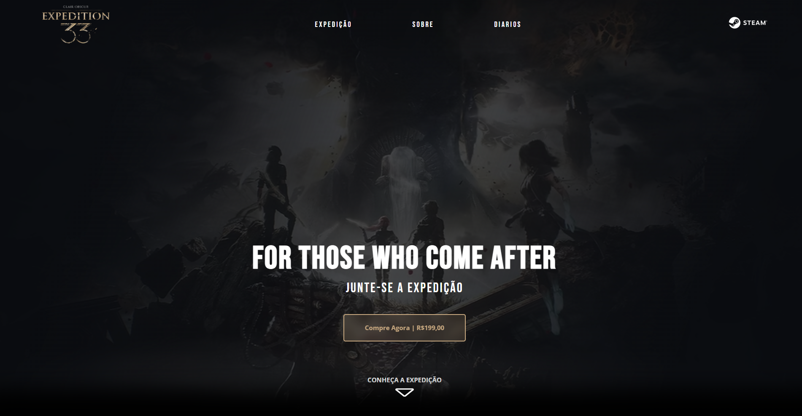

# 🎮 Landing Page - Clair Obscur: Expedition 33

Landing page inspirada no jogo **Clair Obscur: Expedition 33**, desenvolvida como um projeto pessoal para treinar conceitos de **Front-end** e homenagear um dos jogos que mais me marcaram.

---

## 🌟 Sobre o Projeto

Tive a ideia de criar essa página após finalizar o jogo, ele me marcou tanto que quis fazer algo relacionado a ele.  
A proposta foi desenvolver uma **landing page simples**, utilizando **somente código puro**, tanto para passar o tempo quanto para **praticar boas práticas de estruturação de projetos** em HTML, CSS e JavaScript.

---

## 🖼️ Projeto

### Demonstração do Projeto

Você pode conferir o resultado final da landing page clicando no link abaixo 👇  

🔗 **[Acesse o site aqui](https://joaovictorvm.github.io/LP-Expedition33/)**

### Preview

Abaixo está uma pequena prévia do projeto, mostrando um pouco da interface e da atmosfera visual inspirada em *Clair Obscur: Expedition 33*.

---

## 🛠️ Tecnologias Utilizadas

- **HTML**  
- **CSS**  
- **JavaScript**  
- **Figma** (para prototipagem do layout)

Optei por não utilizar frameworks neste projeto, para fortalecer minha base e melhorar minha organização de pastas e componentes em código puro.

---

## 📑 Estrutura e Seções

A landing page foi organizada em diferentes partes que representam elementos marcantes do jogo. Logo no início, a **Hero Section** traz uma das frases mais impactantes da história, servindo como introdução visual e emocional ao conteúdo da página.  
Em seguida, há uma seção dedicada aos **personagens**, que são apresentados em um **slider simples** desenvolvido em JavaScript puro, dando um toque de dinamismo à navegação.  
Também incluí uma **breve sinopse** para contextualizar o enredo do jogo e uma seção de **newsletter**, inspirada nos **diários de expedição** presentes no universo de Clair Obscur.

---

## ⚙️ Funcionalidades e Destaques

O projeto foi desenvolvido de forma leve e objetiva, priorizando a estrutura semântica e a clareza do código.  
Implementei um **slider de personagens** feito manualmente em JavaScript, apenas para adicionar um toque de interatividade ao site.  
Além disso, o layout foi pensado de maneira **modular e organizada**, seguindo boas práticas de separação de estilos e estrutura.

---

## 🧩 Melhorias Futuras

Mesmo sendo um projeto feito principalmente para estudo e diversão, deixei algumas ideias abertas para o futuro. Pretendo adicionar **responsividade completa** para diferentes dispositivos, expandir o conteúdo com **novas telas e seções**, e principalmente incluir um **player de música** para reproduzir a trilha sonora do jogo, o que ajudaria a tornar a experiência ainda mais imersiva.

---

## 👨‍💻 Autor

**João Victor Ventura Martins**

💼 [LinkedIn](https://www.linkedin.com/in/jvvmartins/)  
💻 [Portfólio](https://portfolio-eight-lemon-57.vercel.app/)  
📸 [Instagram](https://www.instagram.com/dev.joaov/)  
🐙 [GitHub](https://github.com/JoaoVictorVM)

---

⭐ Se você curtiu o projeto, deixe uma estrela no repositório!
